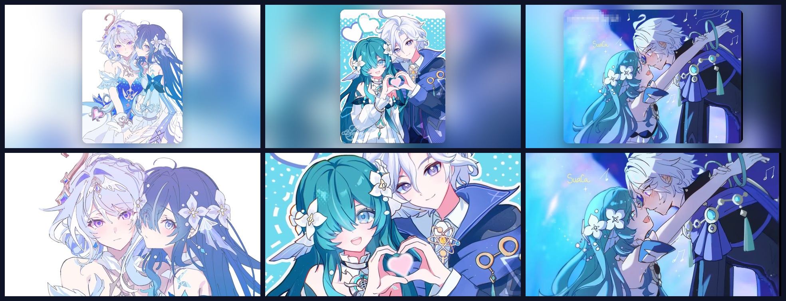

# 💙 原神 CP 壁纸套件 2 · 奥黛塔 × 沃雅妮莎

**单张样式**壁纸包: 3 张同人插画一键切换 / 可视化切换器 / 桌面桌宠 / 多 IDE 皮肤 /
DeepKing 界面皮肤。素材内置于发行包, **离线可用**; 跨平台 Windows / macOS / Linux。



## ✨ 全部样式

| 样式 id | 名称 | 画面 | 处理方式 |
|---|---|---|---|
| `single1` | **相依**(默认) | 奥黛塔与沃雅妮莎相偎 · 星裙钴蓝 | 模糊填充背景 + 居中圆角卡片, **不裁切** |
| `single2` | 星轨 | 蓝白礼服 · 金色星轨饰链 | 同上 |
| `single3` | 比心 | 夜色中双手比心 · 音符星光 | 同上 |
| `cover1` | 相依 · 满屏 | 同上 | cover 铺满, **取景窗自动上移避开人物头部** |
| `cover2` | 星轨 · 满屏 | 同上 | cover 裁切铺满 |
| `cover3` | 比心 · 满屏 | 同上 | cover 裁切铺满 |

> `single*` 完整保留构图(竖图/横图都不裁内容), 四周用同色系重模糊做氛围底;
> `cover*` 满屏无边框。第 1 张是 0.75 的竖图, 直接对半裁会切掉两人的脸,
> 因此 `cover1` 会按素材的取景偏向把窗口上移 —— 这是本套件对 CP1 的改进。

## 🚀 给 AI 一句话安装

把本仓库链接发给**任意 AI**(DeepKing、Claude Code、Kimi Code、CodeX、Trae、Cursor、
JetBrains AI、DSH Harness 等), 它会读 [`AGENTS.md`](AGENTS.md) 替你装完:

```text
请安装 https://github.com/WPH666-py/Genshen-skin-CP2 的原神CP2壁纸
```

## 🖥️ 手动安装

要求: Python 3.9+。Pillow 缺失时脚本会自动 `pip install`。

```bash
# 方式一: 用仓库里已打包好的 wheel(离线可用)
pip install dist/genshen_skin_cp2-0.1.0-py3-none-any.whl
genshen-cp2-install          # 一键: 生成壁纸 + 设为桌面 + 注册已装 IDE

# 方式二: 源码
git clone https://github.com/WPH666-py/Genshen-skin-CP2.git
cd Genshen-skin-CP2
python -m genshen_skin_cp2.engine.autoinstall
```

Windows 用户也可以直接双击 `install.bat`。

## 🎨 常用命令

```bash
genshen-cp2 1              # 换成第 1 张(相依)
genshen-cp2 2              # 换成第 2 张(星轨)
genshen-cp2 3              # 换成第 3 张(比心)
genshen-cp2 cover1         # 第 1 张满屏版
genshen-cp2 random         # 随机来一张
genshen-cp2 list           # 列出所有样式
genshen-cp2 switcher       # 可视化切换器(预览 + 一键应用 + 自动随机)
genshen-cp2 pet            # 桌面桌宠(拖动 / 右键换立绘 / Esc 退出)
genshen-cp2 cycle 30       # 每 30 分钟自动随机换壁纸
genshen-cp2 all --out DIR  # 生成全部 6 种到指定目录
genshen-cp2 deepking       # 生成 DeepKing 界面皮肤 + 离线预览
genshen-cp2 info           # 环境与素材自检
```

常用选项: `--size 2560x1440` 指定分辨率(默认取屏幕分辨率)、`--no-set` 只生成不设置。

## 🧩 IDE / 桌宠支持

| 环境 | 接入方式 |
|---|---|
| **VSCode / Trae / CodeX / Cursor / Windsurf** | 活动栏「原神CP2」→ 皮肤画廊一键换壁纸; 命令面板搜 `原神CP2` |
| **DeepKing** | 设置 → 界面皮肤 → 粘贴本仓库地址, 自动生成星蓝配色皮肤 |
| **PyCharm / WebStorm / IntelliJ** | Settings → Appearance & Behavior → Appearance → **Background Image** |
| **Claude Code / Kimi Code / Harness 等** | 注册 MCP 服务器, AI 直接调 `set_wallpaper` / `next_wallpaper` |
| **桌面桌宠** | `genshen-cp2 pet` —— 透明置顶圆形立绘, 可拖动、右键换图 |

一键注册全部已装 IDE:

```bash
genshen-cp2-install --only vscode jetbrains mcp deepking
```

## 📁 目录

```
src/genshen_skin_cp2/
  characters/odette_voj.py   角色与素材定义(换角色只改这一个文件)
  engine/                    皮肤引擎: 合成 / 壁纸设置 / CLI / 桌宠 / 切换器 /
                             MCP 服务器 / DeepKing 适配 / 自动安装
  deepking_skin.py           手工校色的 DeepKing 调色板(32 槽位)
src/client/                  DeepKing 配色变量 + 维护说明
vscode/                      VSCode/Trae/CodeX 扩展(含打包好的 .vsix)
ide/jetbrains/               JetBrains 背景图指引
tools/                       维护脚本(推送 / 线上契约校验)
AGENTS.md                    给 AI 的自动安装指引
```

## ❓ 常见问题

- **壁纸尺寸**: 默认取主屏分辨率; 多显示器建议加 `--size 2560x1440` 并在系统设置里把壁纸设为「平铺/跨屏」。
- **命令找不到**: Scripts 目录不在 PATH, 改用 `python -m genshen_skin_cp2.engine.cli`。
- **桌宠不透明**: 个别 Linux 桌面不支持透明色键, 会退化为白底卡片, 功能不受影响。
- **切换器/桌宠没反应**: 两者需要本地图形桌面, 远程 SSH 会话下无法显示。
- **改了素材不生效**: 不会 —— 素材或代码更新后会自动重新合成(热更新), 无需清缓存。

## 🔗 与其它套件的关系

与 **CP1**(`Genshen-Skin-CP1` · 米提亚 × 沃雅妮莎)以及 WPH666-py 的其它皮肤套件
**完全独立**: 包名 `genshen-skin-cp2`、命令前缀 `genshen-cp2`、运行时目录 `~/.genshen-cp2`、
vscode 扩展 ID `wp666.genshen-skin-cp2`、DeepKing 皮肤 id `genshen-cp2-odette-voyanisa`
互不冲突, 可同时安装、各自切换。

## 🙏 素材说明

3 张奥黛塔 × 沃雅妮莎同人插画。**仅用于个人桌面美化, 请勿二次商用。** 版权归原作者所有。

## 📄 许可

代码以 MIT 许可发布(见 [LICENSE](LICENSE)); 插画素材不在 MIT 授权范围内。
